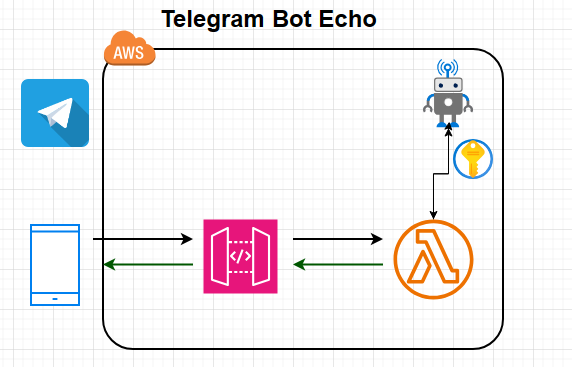
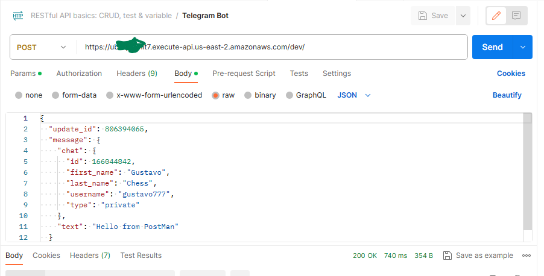
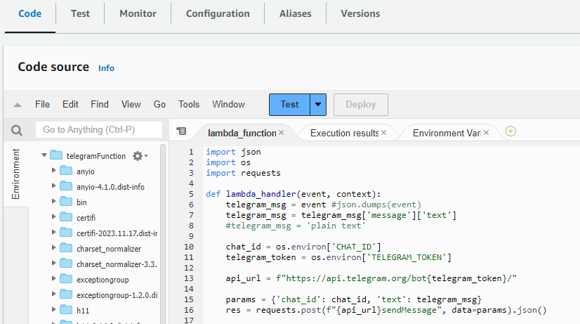
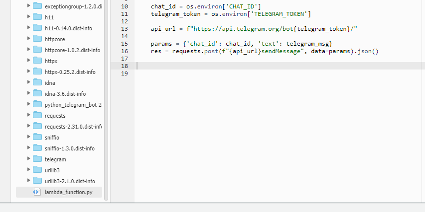

# Telegram bot with AWS Amazon Lambdas and API Gateway
## by Gustavo Carmona Certified Cloud Architect



You'll visit Telegram API with your bot token inside Lambda

## Postman Test example 


## Set the lambda function
1. Create a function
    - Author from scratch
    - give it a name
    - Select Runtime: Python
2. Copy or uplad a Zip File
3. Setup enviromental variables
    - TELEGRAM_TOKEN: 1381220064:XXXXXXXXXXXXXXjlXwkmbZLkOm3PIlqDp0g
    - CHAT_ID: 5XXXXX003
4. Test!
5. Deploy!

### Code Example 




### Generate a zip file
You need requests package and lambda_function in the same folder 
```
pip install --target ./package requests
cd package/
zip -r9 ${OLDPWD}/function.zip .
zip -g function.zip lambda_function.py
```


### Example test
```
{
  "update_id": 806394065,
  "message": {
    "chat": {
      "id": 166044842,
      "first_name": "Gustavo",
      "last_name": "Chess",
      "username": "gustavo777",
      "type": "private"
    },
    "text": "Hello from PostMan v2"
  }
}
```
## Set the API Gateway
- Create a REST API
- Click the actions drop-down and select create method.
- Click on the green POST after clicking the check-mark, and select Lambda function as the integration type.
- Setup test on the “Client” box. Add the same test as in the lambda
- Deploy API 
- If something is not working you may need to setup CORS

## Set Telegram Webhook
- Replace `<ACCESS_TOKEN>` with your Telegram HTTP API access token obtained in the first step.<br>
- Replace `<INVOKE_URL>` with your Invoke URL obtained in the previous step.<br>
Run:
```
$ curl --data "url=<INVOKE_URL>" "https://api.telegram.org/bot<ACCESS_TOKEN>/setWebhook"
```
You should get back a response similar to this:
```
$ {"ok":true,"result":true,"description":"Webhook was set"}
```

## refs
- https://medium.com/@wk0/running-a-serverless-telegram-bot-from-aws-lambda-759b71e13218
- https://medium.com/@wk0/integrating-your-serverless-telegram-bot-with-aws-api-gateway-8a6227d05eb4
